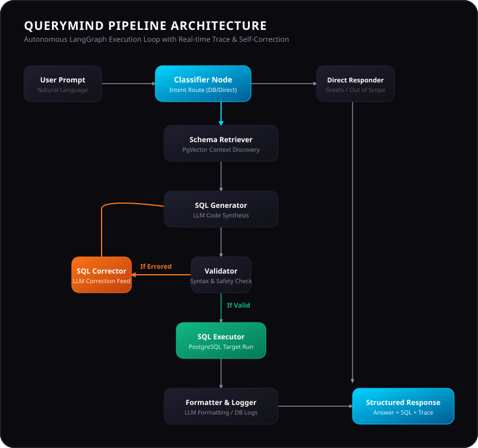

# QueryMind — NL2SQL Agent System

An AI-powered Natural Language to SQL agent that converts plain English questions into accurate PostgreSQL queries, executes them, and returns human-readable answers — with autonomous self-correction and full observability.

Built with **LangGraph** for agentic orchestration, **Groq** (Llama 3.3 70B) for LLM inference, and **pgvector** for semantic schema retrieval.

### 🌐 Live Demo
- **Frontend (Vercel)**: [https://query-mind-nl-2-sql-agent-system.vercel.app](https://query-mind-nl-2-sql-agent-system.vercel.app)
- **Backend Health (Render)**: [https://querymind-backend-wbfj.onrender.com/health](https://querymind-backend-wbfj.onrender.com/health)

---

## ✨ Features

| Feature | Description |
|---------|-------------|
| 🧠 **Natural Language Queries** | Ask questions in plain English — the agent writes, validates, and executes SQL for you |
| ⚡ **Real-Time SSE Streaming** | Tracks node execution durations and streams steps to the UI via Server-Sent Events (SSE) |
| 🔄 **Self-Correction Loop & Replay** | Automatically corrects failed SQL. Replays failures vs corrected queries side-by-side in the UI |
| 🛡️ **SQL Safety Validator** | Blocks dangerous DDL/DML (DROP, DELETE, UPDATE, etc.) before execution |
| 📊 **Interactive Execution Graph** | Custom SVG visualizer mapping active, successful, errored, and skipped node paths in real time |
| 🔍 **Semantic Schema Retrieval** | Uses pgvector embeddings to find relevant tables/columns for each question |
| 📈 **Analytics API & Dashboard** | Success rates, latency tracking, daily stats, and failure analysis |
| ⚡ **95% Benchmark Accuracy** | Tested against 20 real-world business queries with ~3s avg latency |

---

## 💡 Problem

Most NL2SQL systems fail in real-world scenarios:

- ❌ Wrong table selection
- ❌ Broken joins
- ❌ Syntax-valid but logically incorrect SQL
- ❌ No visibility into *why* queries fail

Result: unreliable outputs and zero trust.

---

## ⚡ Solution

QueryMind is a **self-correcting AI agent system** that:

- Generates SQL from natural language
- Validates and executes queries safely
- Automatically detects and fixes errors
- Tracks full execution traces for debugging

---

## 🏗️ Architecture



**10-Node LangGraph Pipeline:**
1. **Query Classifier** — Uses Groq to interpret user intent. Routes simple greetings directly to response nodes or complex queries to database schema retrievers.
2. **Direct Responder** — Formulates instant feedback bypassing database loops for out-of-scope prompts or greetings.
3. **Schema Retriever** — Utilizes SentenceTransformers embeddings and pgvector cosine distance search to locate relevant tables/columns based on question context.
4. **SQL Generator** — Compiles instructions into raw ANSI SQL templates.
5. **SQL Validator** — Uses `sqlglot` to catch syntax errors and enforces strict security rules to prevent DDL/DML injections.
6. **SQL Corrector (Feedback Loop)** — Catching errors from the validator/executor, it loops back to correct the SQL with detailed LLM error messages (retrying up to 3 times).
7. **SQL Executor** — Dispatches queries safely against PostgreSQL.
8. **Failure Handler** — Gracefully handles errors that fail to self-correct.
9. **Result Formatter** — LLM converts raw data to natural language answer.
10. **Query Logger** — Persists full execution trace, latencies, and metadata for analytics.

---

## 🛠️ Tech Stack

| Layer | Technology |
|-------|-----------|
| **Frontend** | Next.js 15, React 19, Tailwind CSS, Recharts, SWR |
| **Backend** | Python 3.12, FastAPI, LangGraph, Groq SDK |
| **Database** | PostgreSQL 15 + pgvector |
| **LLM** | Llama 3.3 70B Versatile (via Groq) |
| **Embeddings** | all-MiniLM-L6-v2 (SentenceTransformers) |
| **Deployment** | Vercel (Frontend) + Render (Backend) + Neon (PostgreSQL) |

---

## 📈 What Makes This Different

This is designed for enterprise-grade database integration:

- **Observability**: Exposes detailed execution metrics and intermediate state traces.
- **Resilience**: Bypasses syntax errors dynamically with LLM corrective feedback loops.
- **Safety Guarantee**: Enforces active sqlglot validators preventing dangerous DDL/DML execution.


## 📁 Project Structure

```
QUERY-MIND/
├── backend/
│   ├── agents/
│   │   ├── graph.py          # LangGraph StateGraph definition
│   │   ├── nodes/            # Directory of modular LangGraph nodes
│   │   │   ├── classifier.py
│   │   │   ├── retriever.py
│   │   │   ├── generator.py
│   │   │   ├── validator.py
│   │   │   ├── executor.py
│   │   │   ├── corrector.py
│   │   │   ├── formatter.py
│   │   │   ├── logger.py
│   │   │   └── utils.py
│   │   └── state.py          # QueryState TypedDict
│   ├── api/
│   │   ├── query.py          # POST /query & GET /query/stream endpoints
│   │   ├── analytics.py      # GET /analytics/* endpoints
│   │   └── embeddings.py     # POST /embeddings/rebuild
│   ├── db/
│   │   ├── connection.py     # asyncpg pool management
│   │   ├── init.sql          # pgvector extension setup
│   │   └── seed.py           # Schema embedding generation
│   ├── config.py             # Environment configuration
│   ├── main.py               # FastAPI app entry point
│   ├── requirements.txt      # Python dependencies
│   └── Dockerfile            # Backend container
├── frontend/
│   ├── src/
│   │   ├── app/
│   │   │   ├── page.tsx          # Query interface
│   │   │   ├── dashboard/page.tsx # Observability dashboard
│   │   │   ├── failures/page.tsx  # Failed queries view
│   │   │   ├── layout.tsx        # Root layout with sidebar
│   │   │   └── globals.css       # Design system
│   │   ├── components/
│   │   │   ├── QueryInput.tsx    # Search input component
│   │   │   ├── ResultTable.tsx   # Data table component
│   │   │   ├── SqlBlock.tsx      # SQL syntax display
│   │   │   ├── MetricCard.tsx    # Metric badge component
│   │   │   ├── PipelineStepper.tsx # [NEW] Real-time steps indicator
│   │   │   ├── CorrectionReplay.tsx # [NEW] Side-by-side SQL diff
│   │   │   ├── AgentExecutionGraph.tsx # [NEW] Custom SVG workflow path
│   │   │   ├── Sidebar.tsx       # Navigation sidebar
│   │   │   ├── SlideOver.tsx     # Slide-over panel
│   │   │   └── charts/          # Recharts components
│   │   └── lib/
│   │       ├── api.ts           # API client functions (streamQuery)
│   │       └── types.ts         # TypeScript interfaces
│   ├── package.json
│   └── next.config.ts
├── tests/
│   ├── unit/                    # 29 unit tests
│   ├── integration/             # 16 integration tests
│   └── benchmark/               # 20-query accuracy benchmark
├── Dataset/                     # Olist e-commerce CSV files
├── render.yaml                  # Render deployment blueprint
├── docker-compose.yml           # Local development (PostgreSQL)
├── .env.example                 # Environment template
└── README.md
```

---

## 🚀 Deployment Guide

### Option A: Deploy to Cloud (Recommended)

#### Step 1: Push to GitHub

```bash
git init
git add .
git commit -m "Initial commit: QueryMind NL2SQL Agent"
git remote add origin https://github.com/moiz-mansoori/QueryMind-NL2SQL-Agent-System.git
git push -u origin main
```

#### Step 2: Deploy Backend to Render

1. Go to [render.com](https://render.com) and sign up (free)
2. Click **"New +"** → **"Blueprint"**
3. Connect your GitHub repository
4. Render will auto-detect `render.yaml` and create:
   - A **PostgreSQL** database (free tier)
   - A **Web Service** for the FastAPI backend
5. After deployment, go to your backend service → **Environment** tab
6. Set `GROQ_API_KEY` to your Groq API key (get one free at [console.groq.com](https://console.groq.com))
7. Copy your backend URL (e.g. `https://querymind-backend.onrender.com`)

#### Step 3: Seed the Database

After Render deploys, populate the database using the secure admin endpoints.

```bash
# 1. Create tables and import CSV data (Step 1/2)
curl -X POST https://YOUR-BACKEND-URL.onrender.com/embeddings/seed \
  -H "x-api-key: YOUR_ADMIN_SECRET"

# 2. Generate schema embeddings (Step 2/2)
curl -X POST https://YOUR-BACKEND-URL.onrender.com/embeddings/rebuild \
  -H "x-api-key: YOUR_ADMIN_SECRET"
```

#### Step 4: Deploy Frontend to Vercel

1. Go to [vercel.com](https://vercel.com) and sign up (free)
2. Click **"Add New..."** → **"Project"**
3. Import your GitHub repository
4. Configure the project:
   - **Framework Preset**: Next.js (auto-detected)
   - **Root Directory**: `frontend`
   - **Build Command**: `npm run build`
   - **Output Directory**: `.next`
5. Add Environment Variable:
   - **Key**: `NEXT_PUBLIC_API_URL`
   - **Value**: `https://YOUR-BACKEND-URL.onrender.com` (from Step 2)
6. Click **Deploy**

#### Step 5: Verify

- Open your Vercel URL → Ask a question → Should get an AI-generated answer
- Visit `/dashboard` → Should see real-time metrics
- Visit `/failures` → Should show any failed queries

---

### Option B: Local Development

#### Prerequisites
- Python 3.12+
- Node.js 18+
- Docker (for PostgreSQL only)

#### Step 1: Clone & Configure

```bash
git clone https://github.com/moiz-mansoori/QueryMind-NL2SQL-Agent-System.git
cd query-mind
cp .env.example .env
# Edit .env and add your GROQ_API_KEY
```

#### Step 2: Start PostgreSQL

```bash
docker-compose up -d postgres
```

#### Step 3: Setup Backend

```bash
cd backend
python -m venv ../venv
..\venv\Scripts\activate    # Windows
# source ../venv/bin/activate  # Mac/Linux

pip install -r requirements.txt
```

#### Step 4: Seed Database

```bash
# From backend/ directory with venv activated
python -c "import asyncio; from db.seed import main; asyncio.run(main())"
```

#### Step 5: Start Backend

```bash
uvicorn main:app --host 127.0.0.1 --port 8000 --reload
```

#### Step 6: Start Frontend

```bash
cd frontend
npm install
npm run dev
```

Open [http://localhost:3000](http://localhost:3000) in your browser.

---

## 📡 API Documentation

| Method | Endpoint | Description |
|--------|----------|-------------|
| `POST` | `/query` | Submit a natural language question |
| `GET` | `/query/stream?question=...` | Stream live LangGraph node-complete execution states and durations via SSE |
| `GET` | `/health` | Health check with database connectivity status |
| `GET` | `/analytics/summary` | Aggregate metrics (total queries, success rate, etc.) |
| `GET` | `/analytics/history?limit=50` | Recent query log entries |
| `GET` | `/analytics/failures?limit=50` | Failed queries only |
| `GET` | `/analytics/slow-queries?threshold_ms=2000` | Queries above latency threshold |
| `GET` | `/analytics/trace/{query_id}` | Full execution trace for a specific query |
| `GET` | `/analytics/daily-stats` | Per-day aggregated statistics |
| `GET` | `/analytics/queries-per-day?days=7` | Queries per day for charts |
| `POST` | `/embeddings/rebuild` | Regenerate schema embeddings (admin) |

### Example Query

```bash
curl -X POST http://localhost:8000/query?include_trace=true \
  -H "Content-Type: application/json" \
  -d '{"question": "How many customers are there?"}'
```

**Response:**
```json
{
  "answer": "There are 96,096 customers in the database.",
  "sql": "SELECT COUNT(DISTINCT customer_unique_id) AS number_of_customers FROM olist_customers",
  "rows": [{"number_of_customers": 96096}],
  "metrics": {
    "retries": 0,
    "latency_ms": 7783.48,
    "success": true
  },
  "error": null,
  "trace_steps": [...]
}
```

---

## 📊 Benchmark Results

| Metric | Value |
|--------|-------|
| **Pass Rate** | 95% (19/20 queries) |
| **Avg Latency** | ~3,100ms |
| **Avg Retries** | 0.15 |
| **Total Time** | 81.5s for 20 queries |

Tested across 5 categories: Simple SELECT, GROUP BY/Aggregation, JOIN, Date Filtering, and Multi-Join queries.

---

## 🧪 Testing

```bash
# Unit Tests (29 tests)
venv\Scripts\pytest tests/unit/ -v

# Integration Tests (17 tests — requires running backend)
venv\Scripts\pytest tests/integration/ -v

# Benchmark (20 queries — requires running backend)
venv\Scripts\python tests/benchmark/benchmark_queries.py
```

---

## 🔮 Future Improvements

- [x] Add authentication (Admin Secret) and rate limiting
- [ ] Support multiple database connections
- [ ] Add query caching layer (Redis)
- [x] Pre-download models in Docker for faster startup
- [x] Implement streaming responses for long-running queries
- [ ] Add chart auto-generation from query results

---

## ⚠️ Future Challenges & Limitations

- Complex multi-table joins can still fail.
- Schema retrieval accuracy depends on vector embedding quality.
- Cold start latency exists on the Render free tier host (~10-15s for first request after inactivity).

---

## 📄 License

MIT License — feel free to use this project for learning, portfolios, or production.